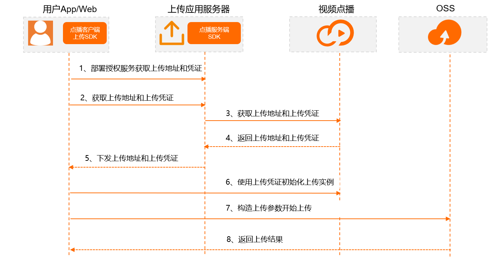
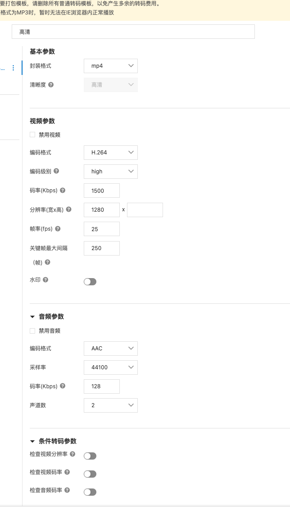

## 前言

<!-- more -->

## 需求背景

## 需求目标

## 需求分析

### 整体流程

## 概要设计

## 详细设计

### 视频上传

客户端上传 SDK 封装了 OSS 上传逻辑。在客户端上传媒体文件时，会直接将文件上传到点播存储（基于 OSS），不会再经服务端进行中转，故客户端上传必须进行鉴权，也就是需要您在应用服务器上部署授权服务以获取上传地址和凭证。目前客户端上传 SDK 支持两种授权方式：

- 使用上传地址和凭证授权：建议集成点播服务端 SDK 来获取上传地址和凭证。
- 使用 STS 方式授权：需要提前为 RAM 用户创建角色并授权，也需要自行搭建 STS 授权服务。

### 视频存储

免费视频和付费视频存储在同一个 oss bucket，状态变更时只需要更改业务表的状态即可。oss 自有 bucket 对智能审核能力的支持不完善

### 视频转码

是否开启视频转码由获取上传凭证时获取在，获取视频上传凭证时通过**判断文件格式来**确认是否开始视频转码。目前仅以下格式支持不转码直接播放：MP4、FLV、M3U8、MP3、WEBM。

目前单个清晰度至少 1 种格式的转码完成即可播放。

通过调用[获取音视频上传地址和凭证](https://help.aliyun.com/document_detail/55407.htm#doc-api-vod-CreateUploadVideo)或[URL 拉取上传](https://help.aliyun.com/document_detail/86311.htm#doc-api-vod-UploadMediaByURL)接口上传视频时指定所使用的转码模板组 ID（TemplateGroupId），上传完成后点播系统会自动根据所指定的模板进行转码，并且会根据用户配置的回调，将转码后的信息回调给用户。

### 视频审核

视频上传后调用提交审核接口，定时任务扫表查询审核中的视频，同步视频审核状态。

先开启智能审核，对于疑似视频提交人工审核。

### 视频播放

用户上传视频完成后，并不代表视频已准备就绪，还需点播服务端确认接收完成，可根据**事件通知**来确定上传的视频何时能播放。

- 对于不转码的视频（或音频）接收到[视频上传完成](https://help.aliyun.com/document_detail/55630.htm#concept-2526104)事件通知后即可进行播放，此时可通过调用[获取视频播放地址](https://help.aliyun.com/document_detail/56124.htm#doc-api-vod-GetPlayInfo)接口获取到播放地址，目前仅以下格式支持不转码直接播放：MP4、FLV、M3U8、MP3、WEBM。
- 对于转码的视频，接收到[单个清晰度转码完成](https://help.aliyun.com/document_detail/55636.htm#concept-2526106)事件通知后即可进行播放，若要确保所有清晰度都能获取到，可接收到[视频转码完成](https://help.aliyun.com/document_detail/55638.htm#concept-2526107)再处理。

**本文采用服务端下发播放地址的方案**

| 播放方式     | 优点                                   | 缺点                           |
| ------------ | -------------------------------------- | ------------------------------ |
| 使用播放地址 | 使用播放地址可以给客户端指定返回的域名 | 安全性稍差                     |
| 使用播放凭证 | 安全性更高                             | 需要多请求一次才能拿到播放地址 |

**免费视频和付费视频存储在同一个 oss bucket，同时配置两个域名，两个域名都开启 url 鉴权，付费视频域名开始远程鉴权。通过服务端接口获取播放地址时设置播放地址有效时间，并根据视频是否付费返回不同的域名。**
**若只开启付费视频域名 url 鉴权，那么可以通过免费视频域名访问到付费视频，所以两个域名都必须开始 url 鉴权，播放地址设置过期时间动态获取。**
**免费视频可以将过期时间设置无限制，付费视频过期时间设置小一点。未来可能存在免费视频和付费视频状态转换的场景，不存储固定播放地址，只需要更改业务表状态即可获得不同的播放地址。**
付费视频可以设置试看地址，用户无权限时返回一个试看地址。
固定地址消耗流量较大，会被攻击。
播放地址有效期太长容易被攻击，有效期太短客户端缓存容易引发 bug。

### 视频安全

视频安全机制根据域名来配置，免费视频和付费视频需要使用不同域名，域名指向同一个 oss bucket
[https://help.aliyun.com/document_detail/99436.html](https://help.aliyun.com/document_detail/99436.html)
采用以下几个安全机制

- URL 鉴权
- 远程鉴权

### 事件通知回调

监听以下几个事件类型

1. 视频上传完成 保存视频类型。_`step1-接收到该事件后不需要转码的视频可播放`。可能和音视频分析完成事件同时到达或者上传完成后到达。上传完成后可转码和视频审核_
2. *`音视频分析完成` 所有上传文件默认会进行源文件分析，保存视频基本信息，*当接收到**音视频分析完成**的事件通知后，再调用\***\*获取单个音视频信息\*\***获取音视频信息，判断是否转码，再判断是否白名单，不转码并且是白名单先发布再提交审核。如果转码则不处理等待转码回调。_`step2-接收到该事件后获取到视频基本信息,对于不需要转码的视频跳过step3`_
3. 视频截图完成 事件完成后能获取到视频封面图
4. _`单个清晰度转码完成` 当接收到转码完成事件通知后，判断是否是白名单，如果是白名单用户发布贴子，最后提交审核。**`step3`-**`对于转码的视频 1个清晰度转码完成即可播放`_
5. _`视频AI处理完成(智能审核)` 审核通过后判断是否白名单，白名单用户发送钉钉通知，普通用户发布帖子并发送钉钉通知。\*\*`step4`_

### 定时任务兜底补偿

视频检测结果表有三个状态,待审核 处理中 处理完成，扫表查询同步 5 分钟还没提交审核的数据，查询同步 10 分钟还未审核结束的数据
判断视频的各个状态回调失败的情况 上传状态 解析状态 转码状态 审核状态
客户端上报视频信息时保存视频数据，视频审核数据，定时任务扫视频审核表查询单个音视频信息根据返回状态处理后续流程 [https://help.aliyun.com/document_detail/436571.html](https://help.aliyun.com/document_detail/436571.html) 查询单个音视频信息 [https://help.aliyun.com/document_detail/436575.html](https://help.aliyun.com/document_detail/436575.html)获取源文件信息

### 视频点播平台配置

1. 配置阿里云 vod url 鉴权 配置管理-分发加速配置-域名管理-访问控制
2. 配置域名 https 配置管理-分发加速配置-域名管理-HTTPS 配置
3. 配置阿里云 vod 回调事件 配置管理-媒体处理配置-回调设置
   1. 视频上传完成
   2. 音视频解析完成
   3. 3. 视频截图完成
   4. 4. 单个清晰度转码完成
   5. 5. 智能审核完成
4. 设置转码模版 配置管理-媒体处理配置-转码模版组
   1. 1. **开启条件转码参数-检查视频分辨率-按原片转码**

## 数据库设计

## 接口设计

## 后记

## 参考资料
