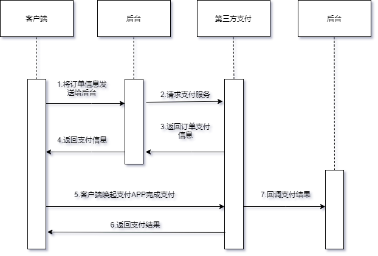

## 前言

## 幂等性接口

- 插入语句
- 删除语句
- 更新语句-更新状态
- 更新语句-更新字段数字大小

## 幂等性业务场景

### 充值业务

支付流程图



新建三张表
- recharge_order:充值订单表
- user_recharge:用户充值表
- user_recharge_detail:用户充值明细流水表

```SQL
CREATE TABLE `recharge_order` (
  `id` bigint(11) NOT NULL AUTO_INCREMENT COMMENT '主键id',
  `state` tinyint(4) DEFAULT '0' COMMENT '订单状态:0-待支付,1-已支付,2-已取消,3-已失效',
  `trade_no` varchar(255) DEFAULT '' COMMENT '第三方支付订单号',
  `amount` decimal(12,2) NOT NULL DEFAULT '0.00' COMMENT '订单金额',
  `create_time` datetime DEFAULT NULL COMMENT '创建时间',
  `update_time` datetime DEFAULT NULL COMMENT '更新时间',
  PRIMARY KEY (`id`)
) ENGINE=InnoDB DEFAULT CHARSET=utf8mb4 COMMENT '充值订单表';

CREATE TABLE `user_recharge` (
  `id` bigint(11) NOT NULL AUTO_INCREMENT COMMENT '主键id',
  `balance` decimal(12,2) DEFAULT '0.00' COMMENT '余额',
  `create_time` datetime DEFAULT NULL COMMENT '创建时间',
  `update_time` datetime DEFAULT NULL COMMENT '更新时间',
  PRIMARY KEY (`id`)
) ENGINE=InnoDB DEFAULT CHARSET=utf8mb4 COMMENT '用户充值表';

CREATE TABLE `user_recharge_detail` (
  `id` bigint(11) NOT NULL AUTO_INCREMENT COMMENT '主键id',
  `trade_no` varchar(255) DEFAULT '' COMMENT '第三方支付订单号',
  `amount` decimal(12,2) NOT NULL DEFAULT '0.00' COMMENT '充值金额',
  `before_balance` decimal(12,2) NOT NULL DEFAULT '0.00' COMMENT '充值前金额',
  `after_balance` decimal(12,2) NOT NULL DEFAULT '0.00' COMMENT '充值后金额',
  `create_time` datetime DEFAULT NULL COMMENT '创建时间',
  `update_time` datetime DEFAULT NULL COMMENT '更新时间',
  PRIMARY KEY (`id`)
) ENGINE=InnoDB DEFAULT CHARSET=utf8mb4 COMMENT '用户充值明细流水表';
```
